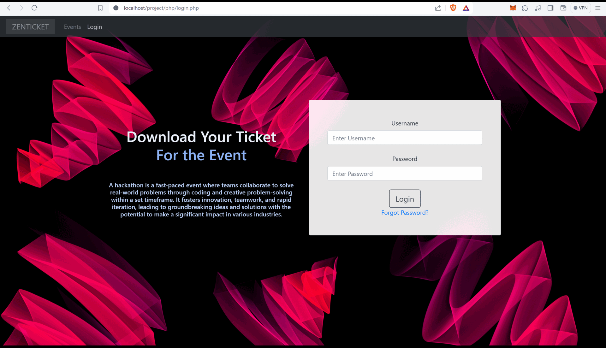

# Project Name: Online Unique Ticket Generator and Printing System with User Authentication and Chatbot Support

Description:
The Online Unique Ticket Generator and Printing System is a comprehensive web-based application developed using PHP, MySQL, and incorporating user authentication and chatbot support. This project offers a convenient and efficient solution for generating unique ticket numbers, managing user access securely, and providing customer support through a chatbot interface. With its user-friendly interface and robust functionality, this project is ideal for organizations and businesses that require an integrated online ticketing system with enhanced user authentication and support features.

# Images

<p align="center">
  
</p>

Key Features:

1. **User Authentication (Login and Registration):**
   - Users can securely log in using their credentials, with passwords stored using the bcrypt algorithm for encryption.
   - New users can register by providing necessary information, and the registration process includes secure password storage using bcrypt.

2. **Chatbot with Personalized Mailing:**
   - Users can interact with a chatbot for customer support.
   - Personalized mailing functionality enables user communication and support.

3. **Database Integration:**
   - User registration details are stored in an SQL database.
   - The stored information is retrieved when creating a new ticket, with user details used to personalize the ticket creation process.

4. **Ticket Number Generation:**
   - Unique ticket numbers are generated, ensuring each ticket has a distinct identification.
   - A predefined value is added to a user-provided ticket number to create a unique identifier.

5. **SVG Integration:**
   - SVG is used to visualize the unique ticket identifier, providing flexible and responsive visuals.

6. **Content Generation through Explainable AI:**
   - Unique messages are generated for each user, enabling personalization and improving the user experience.

7. **Admin Dashboard for Monitoring:**
   - Role-based access control (RBAC) is implemented for admins, allowing them to update, create, or delete any user.
   - Admins can check analytics such as the time of day users have logged in and the day of the week of registrations.

8. **Downloadable and Uneditable PNG:**
   - Converted PNG tickets are made available for users to download, enabling offline use or sharing.
   - PNG format ensures tickets cannot be easily edited, maintaining the integrity of ticket information.

**Database Structure (SQL Syntax):**
```sql
CREATE TABLE users (
    id INT(11) PRIMARY KEY AUTO_INCREMENT,
    username VARCHAR(50) NOT NULL,
    password VARCHAR(255) NOT NULL,
    created_at DATETIME NOT NULL DEFAULT current_timestamp(),
    city VARCHAR(100),
    referral VARCHAR(100),
    event VARCHAR(100) NOT NULL DEFAULT 'Codeflix'
) DEFAULT CHARACTER SET utf8mb4 COLLATE utf8mb4_general_ci;
```

```sql
CREATE TABLE eventdata (
    id INT(100) AUTO_INCREMENT PRIMARY KEY,
    name VARCHAR(255) COLLATE utf8mb4_general_ci NOT NULL,
    date DATE NOT NULL,
    time TIME NOT NULL,
    price INT(100) NOT NULL
);

```

```sql
ALTER TABLE `users` ADD `reset_token_hash` VARCHAR(64) NULL AFTER `event`, ADD `reset_token_expires_at` DATETIME NULL DEFAULT NULL AFTER `reset_token_hash`;
```

```sql
ALTER TABLE `users` ADD `email` INT(255) NOT NULL AFTER `password`;
```

```sql
ALTER TABLE `users` CHANGE `email` `email` VARCHAR(255) NOT NULL;
```

The Online Unique Ticket Generator and Printing System with User Authentication and Chatbot Support provides organizations with an all-in-one solution for ticket generation, user authentication, and customer support. By leveraging PHP, MySQL, and advanced features such as chatbot support and explainable AI, this project simplifies ticketing processes while enhancing security and user experience. Streamline your ticketing operations and provide exceptional customer service with this comprehensive online application today!
